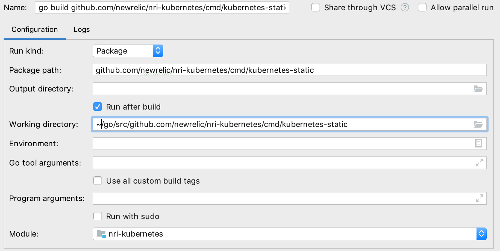

# Kubernetes Static

Kubernetes Static is a project used to run the Kubernetes Integration locally on your machine, without needing a running kubernetes cluster with KSM.

## How it works

The files in the `./data` folder are saved outputs from KSM and various kubelet endpoints, all required to run the full integration. 
The program wil start a temporary HTTP server and serve these files. The groupers are configured to use these endpoints instead of discovering them.

## Running kubernetes-static

From within this directory, run the following command in your terminal
```shell script
go run main.go basic_http_client.go 
```

This is not sending any data to an agent, but outputs the JSON to stdout. 

## Configuring your IDE

It's import that the working directory is set to `cmd/kubernetes-static`, because it expects that the `data` folder is in the process's working directory. 
Some IDE's/editor use a temporary folder as the working directory. 

Example configuration for GoLand:


