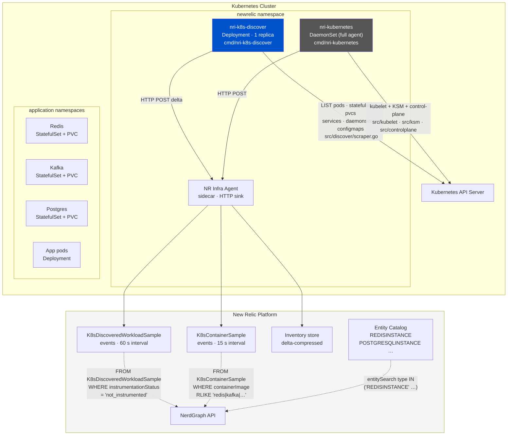
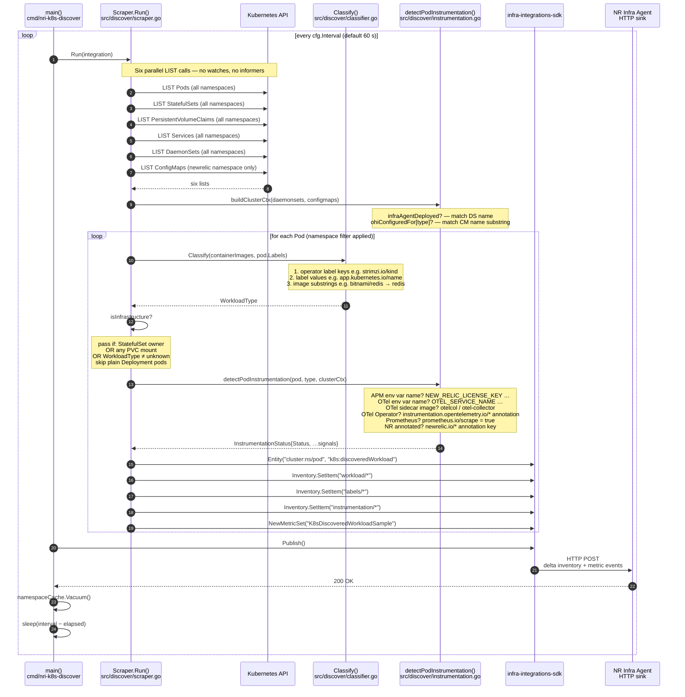
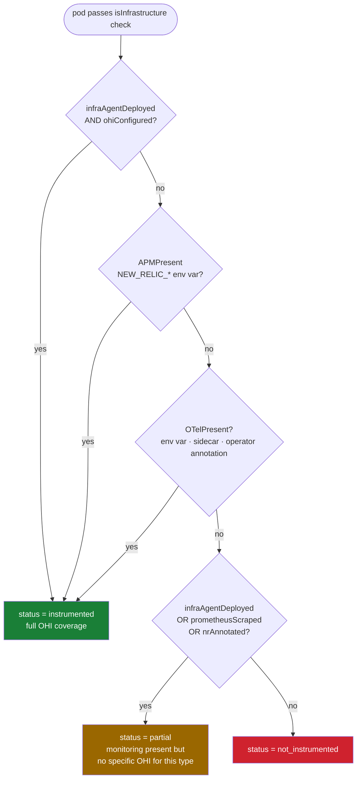

# nri-k8s-discover: Architecture

Two diagrams: the component overview and the per-cycle sequence.

---

## 1. Component overview — two paths to infra discovery

**When to use each path**

| | Discovery agent only | Full agent (+ optional discovery agent) |
|---|---|---|
| Cluster has no NR agent yet | ✓ | — |
| Instrumentation gap detection | ✓ `instrumentationStatus` field | NerdGraph entity search |
| Full K8s metrics (CPU/mem/net) | ✗ | ✓ `K8sContainerSample` |
| Monthly ingest (2-node GKE) | ~22 MB | ~3.5 GB |

---

## 2. Discovery cycle sequence — one `Run()` call

---

## 3. Instrumentation status decision tree

